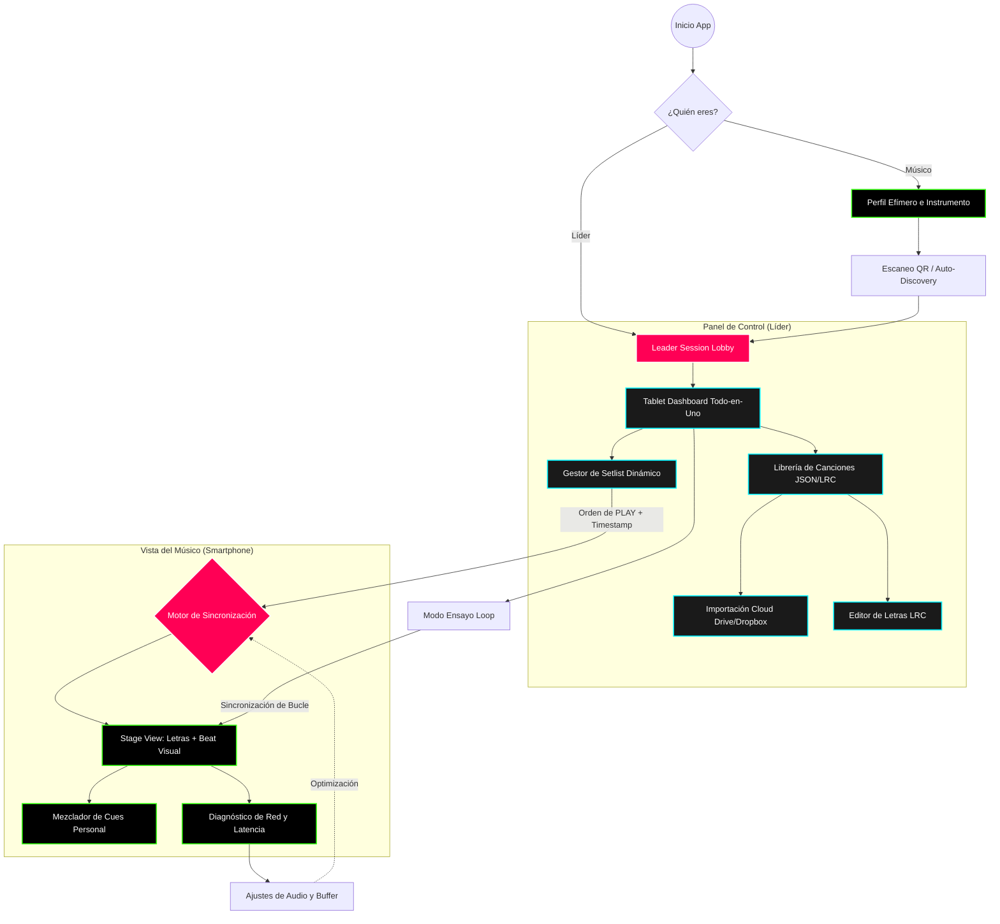

```mermaid
graph TD
    %% Roles de Usuario
    Start((Inicio App)) --> RoleSel{¿Quién eres?}
    
    %% Flujo de Configuración Inicial (Onboarding/Perfil)
    RoleSel -->|Músico| Profile[Perfil Efímero e Instrumento]
    RoleSel -->|Líder| Lobby[Leader Session Lobby]
    
    %% Conexión
    Profile --> QR[Escaneo QR / Auto-Discovery]
    QR --> Lobby
    
    %% Dashboard del Líder (Tablet/PC)
    subgraph "Panel de Control (Líder)"
        Lobby --> TabletDash[Tablet Dashboard Todo-en-Uno]
        TabletDash --> Library[Librería de Canciones JSON/LRC]
        Library --> Cloud[Importación Cloud Drive/Dropbox]
        Library --> LRCEdit[Editor de Letras LRC]
        TabletDash --> Setlist[Gestor de Setlist Dinámico]
    end

    %% Sincronización en Tiempo Real
    Setlist -->|Orden de PLAY + Timestamp| SyncEngine{Motor de Sincronización}
    
    %% Vistas de Ejecución (Músicos)
    subgraph "Vista del Músico (Smartphone)"
        SyncEngine --> StageView[Stage View: Letras + Beat Visual]
        StageView --> Mixer[Mezclador de Cues Personal]
        StageView --> Diagnostics[Diagnóstico de Red y Latencia]
    end

    %% Modos Especiales
    TabletDash --> LoopMode[Modo Ensayo Loop]
    LoopMode -->|Sincronización de Bucle| StageView
    
    %% Ajustes Técnicos
    Diagnostics --> AudioSettings[Ajustes de Audio y Buffer]
    AudioSettings -.->|Optimización| SyncEngine

    %% Estética
    classDef leader fill:#1a1a1a,stroke:#00f2ff,stroke-width:2px,color:#fff;
    classDef follower fill:#000,stroke:#39ff14,stroke-width:2px,color:#fff;
    classDef sync fill:#ff0055,stroke:#fff,stroke-width:2px,color:#fff;
    
    class TabletDash,Library,Cloud,LRCEdit,Setlist leader;
    class StageView,Mixer,Diagnostics,Profile follower;
    class SyncEngine,Lobby sync;
```